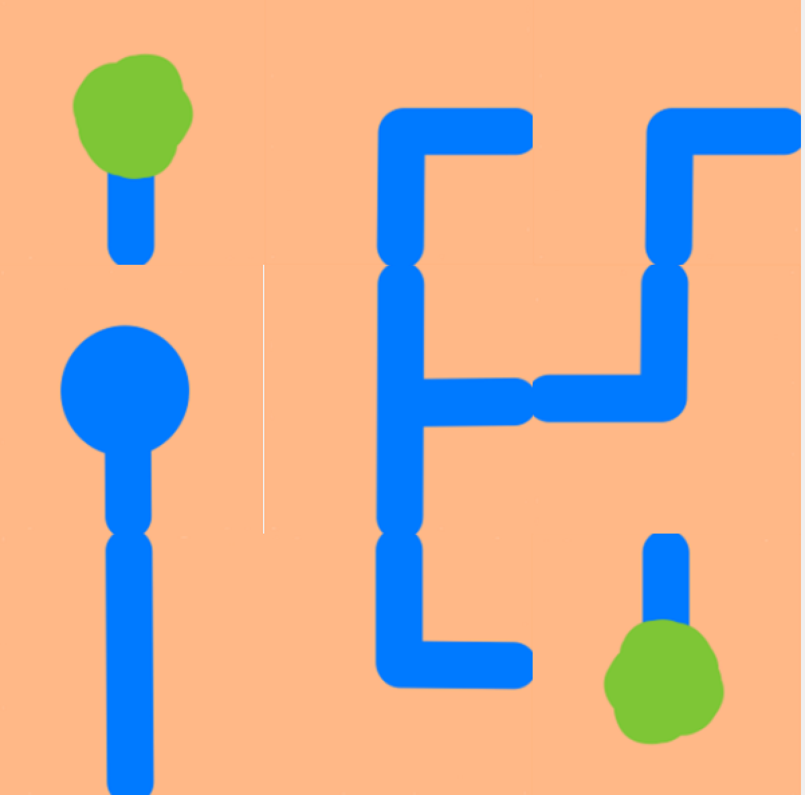
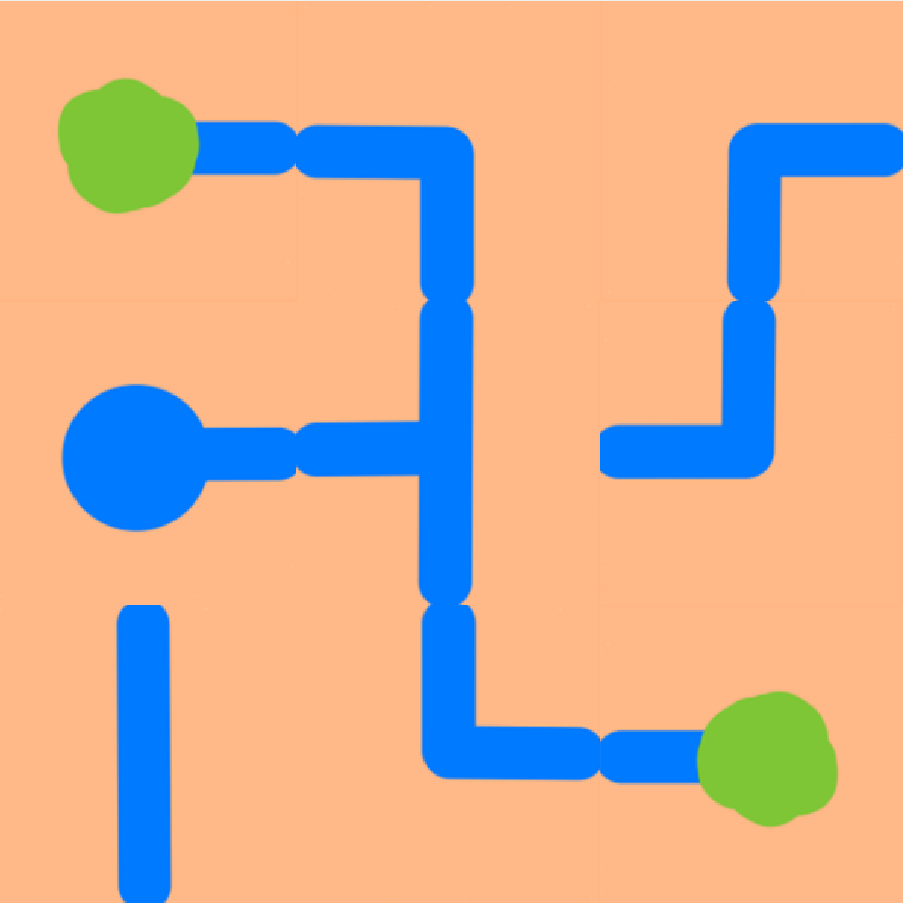

<h1>
WaterConnect Puzzle Game   
</h1>

This is my implementation of the WaterConnect PuzzleGame. I faced this "challenge" at my algorithms & datastructurs module @ bfh and wanted to implment it.
The idea is, to connect all the bushes to the well with the help of different shaped pipes.
You can click on a tile to rotate it by 90 degrees. 

<h2>The game logic</h2>

      1. The playfield:
         It is represented as a 2d array[][]. Each tile you can find on the playfield is a element of the array
   
      2. The tile:
         Each tile is defind by a Tuple of five elements. 
         The first four elements ar boolean (0 or 1) which tells if there are entrys / exits of the tile
            - 0th for north
            - 1th for east
            - 2nd for south
            - 3rd for west
      
         The last element tells us the type of the tile:
            - 0 = pipe
            - 1 = well
            - 2 = bush
      
         So a L shaped pipe would look like this: (1,1,0,0,0)

      3. The Tree:
         To compute if the game is won, I needed to implement a tree structure with a recursiv search algorithm 
         (I used DFS) to check the neighbouring tiles for
            - a connection to the current tile, and 
            - b if the neighbouring tile is a bush or pipe

As my experience with python is relatively low, I used chatgpt to help me with the canvas and loading the selfmade images in the right order, depending on the matrix.

<h2>How the game looks</h2>

    &nbsp;
    &nbsp;

   
